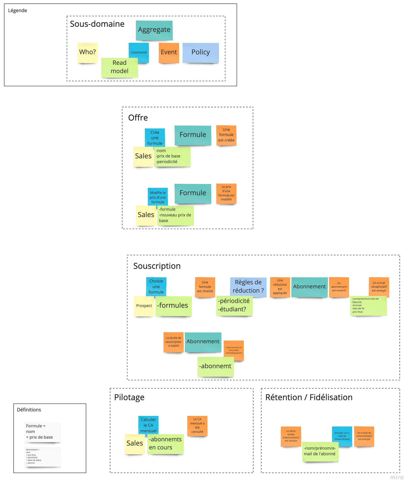

# DDD01 : Salle de sport

## Énoncé
- Je peux créer de nouvelles formules, au mois ou à l’année, avec les règles suivantes:
  - un prix de base est fixé
  - auquel on applique 30% de réduction si le client souscrit à un abonnement annuel

- En tant qu’étudiant, j’ai 20% de réduction sur le prix de mon abonnement

- Je peux voir le chiffre d’affaire en fonction du nombre d’abonnements en cours pour un mois donné

- Après s’être abonné, l’abonné reçoit un email récapitulatif

- Je peux changer le prix d’une formule

- Un abonnement se renouvelle automatiquement

- Au bout de 3 ans d’abonnement, l’abonné reçoit un email de remerciement

## EventStorming

## Implémentation
- Utilisez le langage que vous voulez
  - Mais pas de framework

- Pas de HTTP, donc pas de contrôleurs

- Pas de base de données
  - Tout en mémoire

- Tester toutes les fonctionnalités
- Gestionnaire de dépendances autorisé pour ajouter une lib de tests

- Le métier ne parle que français, donc le code métier doit être en français

- Organiser le code en fonction des _Bounded Contexts_

- On ne veut pas voir d’`AbonnementService` !

